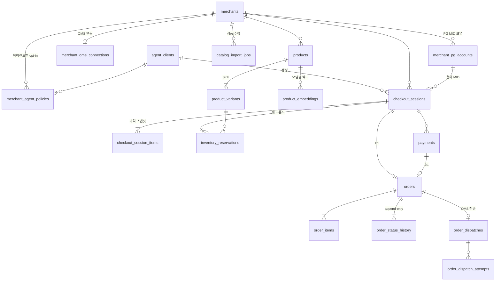

# 01. Data Model / DB Schema

> 정본 DDL: [`db/migration/V1__init_schema.sql`](../db/migration/V1__init_schema.sql) (PostgreSQL 16 + pgvector + pg_bigm, Flyway 네이밍)

## 1. ERD (핵심 엔티티)



부가 테이블: `pg_webhook_events`(Inbox), `outbox_events`(Outbox), `idempotency_keys`, `audit_logs`(월 파티션).

## 2. 상태 머신

### Checkout Session
```
OPEN ──(결제 페이지 진입/PG 결제창 호출)──▶ PAYMENT_PENDING ──(PG 승인 검증 OK)──▶ COMPLETED
  │                                         │
  ├──(TTL 만료, 기본 30분)──▶ EXPIRED ◀──────┤
  ├──(에이전트 cancel)─────▶ CANCELED        └──(PG 실패/금액 불일치)──▶ FAILED
```
- `EXPIRED/CANCELED/FAILED` 전이 시 `inventory_reservations` → `RELEASED/EXPIRED`, `product_variants.reserved_quantity` 차감을 **같은 트랜잭션**에서 수행.
- **만료 후 늦게 도착한 승인 웹훅**(사용자가 결제창을 30분 넘게 띄워둔 경우): 재고가 남아 있으면 재홀드 후 정상 처리, 없으면 즉시 PG 취소(자동 환불) + `FAILED`. 결제창 자체 유효시간을 세션 TTL보다 짧게 설정해 발생 빈도를 줄인다.

### Order
```
CREATED ─▶ DISPATCHING ─▶ ACCEPTED ─▶ SHIPPED ─▶ DELIVERED
                 │             └──▶ CANCEL_REQUESTED ─▶ CANCELED ─▶ REFUNDED
                 └──(OMS 품절/거절)──▶ REJECTED ─▶ (자동 PG 취소) ─▶ REFUNDED
```
모든 전이는 `order_status_history` 에 append, `version` 낙관적 락으로 경합 방지.

## 3. 설계 결정과 근거

| 항목 | 결정 | 이유 |
|---|---|---|
| 금액 타입 | `BIGINT` minor unit + `currency` | 부동소수 오차 차단. KRW는 원 단위, USD는 cent. |
| 외부 ID | prefix + ULID (`cs_`, `ord_`…) | 시간순 정렬(B-tree 지역성), 열거 공격 방지, 로그 가독성. |
| 상태 타입 | `TEXT + CHECK` | PG `ENUM`은 값 삭제/재정렬 불가 → 무중단 배포에 불리. |
| 1 세션 = 1 가맹점 | 강제 | 결제가 **가맹점 MID로 직접** 일어나므로 MID가 다르면 결제 자체가 분리됨. 멀티 가맹점 장바구니는 에이전트가 세션을 N개 생성. |
| 가격 스냅샷 | `checkout_session_items` | 세션 생성 이후 가맹점 가격 변경과 결제 금액 분리. 웹훅 검증 기준값. |
| 재고 | DB 조건부 UPDATE 기반 홀드 | `UPDATE … SET reserved_quantity = reserved_quantity + :q WHERE id = :id AND stock_quantity - reserved_quantity >= :q` (영향 행 0 → 품절). Redis 분산락보다 단순·정확, CHECK 제약이 최후 방어선. Redis는 조회 캐시로만 사용. |
| 이중결제 방지 | 3중 | ① `idempotency_keys` ② `payments` 부분 유니크 인덱스(세션당 승인 1건) ③ `orders.checkout_session_id UNIQUE`. |
| 웹훅 | Inbox 테이블 + `UNIQUE(pg_provider, dedupe_key)` | 중복/재전송 웹훅을 DB 레벨에서 흡수. 수신 즉시 200 → 비동기 처리. |
| 이벤트 발행 | Transactional Outbox | 주문 커밋과 SQS 발행 원자성. dual-write 금지. |
| PII | 애플리케이션 envelope 암호화(KMS) + blind index | RDS 저장 시 암호화(at-rest)만으로는 DB 덤프/운영자 조회 노출 대응 불가. 개인정보보호법 기술적 보호조치 기준. |
| 자격증명 | Secrets Manager ARN만 저장 | DB 유출 시 PG/OMS 키 동반 유출 차단, 로테이션 용이. |
| 임베딩 | `(product_id, model)` PK | 임베딩 모델 교체 시 신규 모델로 백필 후 스위치(blue/green). |
| 한글 검색 | `pg_bigm` | PG 기본 FTS는 한국어 형태소 미지원. 초기 규모(<수백만 SKU)는 bigm + pgvector로 충분, 이후 OpenSearch(nori + k-NN) 이관. |

## 4. 잠재 리스크 (리뷰어 관점)

1. **OMS 재고 ≠ 플랫폼 재고**: 가맹점은 자사몰/오픈마켓에서도 동시에 판매하므로 `stock_quantity`는 항상 *지연된 사본*이다. 홀드는 "우리 채널 내" 초과판매만 막는다. → `stock_synced_at`을 에이전트에 노출하고, OMS 주문 전송 실패(품절) 시 자동 환불 경로를 1급 시나리오로 설계.
2. **`reserved_quantity` 핫로우**: 인기 SKU에 동시 체크아웃 몰리면 row lock 경합. 초기엔 문제없으나 타임딜류 트래픽이면 Redis Lua 기반 카운터 + DB 비동기 반영으로 전환 고려.
3. **만료 스위퍼 누락**: 홀드 해제 배치가 죽으면 재고가 묶인다. `idx_resv_expiry` 기반 배치 + "홀드 수량 / 실재고" 비율 알람 필요.
4. **`audit_logs` 파티션 선생성 누락** 시 INSERT 실패 → 기능 장애로 번짐. `pg_partman` + DEFAULT 파티션 추가 검토.
5. **`pg_raw` 마스킹**: PG 응답에 카드 BIN/마스킹번호, 승인번호가 포함된다. 저장 전 allowlist 기반 필드 필터 필수 (denylist 방식 금지).
